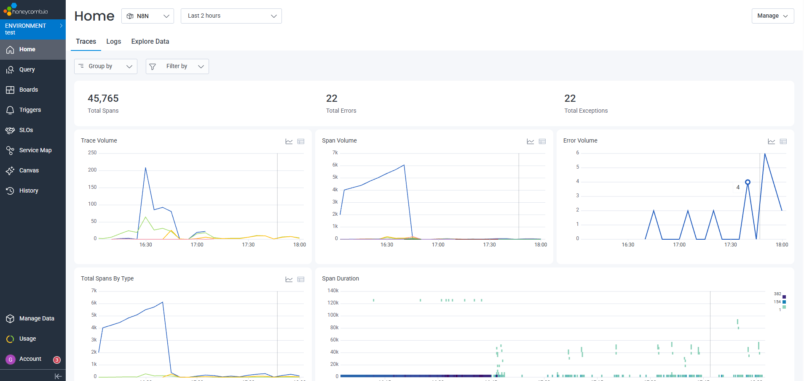
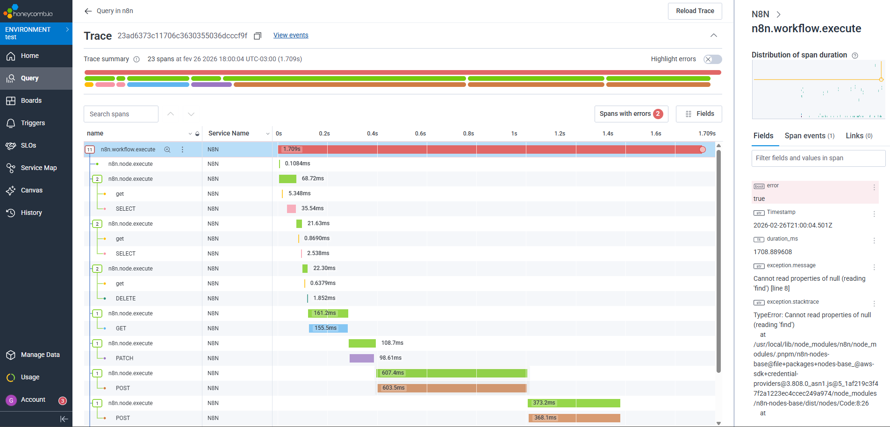
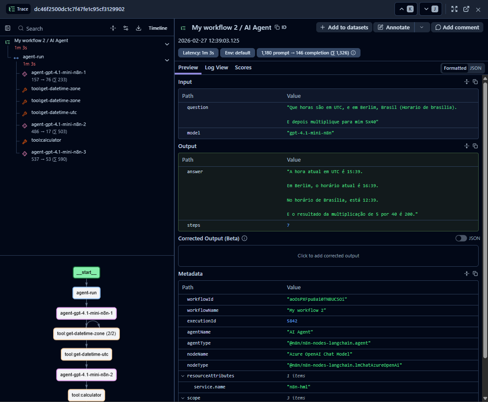

# n8n-tracekit (n8n 2.x.x + OpenTelemetry)

OpenTelemetry‑enabled n8n image with ready‑to‑use tracing instrumentation.
This stack is referred to as **n8n-tracekit**.

## Key Capabilities

- OpenTelemetry traces enabled out of the box for n8n executions.
- Same image for `main`, `webhook`, and `worker` services.
- Works with external PostgreSQL and Redis backends.
- Supports both full pipeline OTLP and traces‑only backends.

## Observability Screenshots







## Docker Image

- Docker Hub: `gabrielhmsantos/n8n-tracekit`
- Tags follow the n8n version (example: `gabrielhmsantos/n8n-tracekit:2.9.4`).
- `latest` is updated when the workflow runs without a specific version.

## Quick Start

A ready‑to‑use compose file is provided at `.examples/docker-compose.yaml`.

Steps:
1. Copy `.env.example` to `.env` and update the placeholders.
2. Run:

```bash
docker compose -f .examples/docker-compose.yaml --env-file .env up -d
```

You must replace at least:
- `POSTGRES_HOST`, `POSTGRES_PASSWORD`
- `REDIS_HOST`
- `N8N_ENCRYPTION_KEY`
- `N8N_RUNNERS_AUTH_TOKEN`
- `N8N_HOST`, `N8N_EDITOR_BASE_URL`, `WEBHOOK_URL`

## Workflow Tracing - OpenTelemetry Configuration

Use one of the scenarios below. Set them in your `.env`.

Scenario A: full pipeline (traces + logs + metrics)
Use when your backend accepts logs and metrics (Honeycomb, Datadog, New Relic, etc.).

```bash
TRACING_WORKFLOW_ENABLED=true
OTEL_SERVICE_NAME=n8n
OTEL_EXPORTER_OTLP_PROTOCOL=http/protobuf
OTEL_EXPORTER_OTLP_ENDPOINT=https://otel-collector.example.com
OTEL_LOG_LEVEL=INFO
```

Scenario B: traces only
Use when traces go to Tempo or Elastic APM and logs are handled elsewhere (e.g., Loki).

```bash
TRACING_WORKFLOW_ENABLED=true
OTEL_SERVICE_NAME=n8n
OTEL_EXPORTER_OTLP_PROTOCOL=http/protobuf
OTEL_EXPORTER_OTLP_TRACES_ENDPOINT=https://tempo.example.com
OTEL_LOGS_EXPORTER=none
OTEL_METRICS_EXPORTER=none
```

Authentication (if required):

```bash
OTEL_EXPORTER_OTLP_HEADERS=authorization=change_me
```

Tracing log levels (.env):

```bash
TRACING_LOG_LEVEL=info
OTEL_LOG_LEVEL=info
```

## LLM Tracing - Langfuse Configuration

```bash
TRACING_LLM_ENABLED=true
TRACING_LLM_DEBUG_EVENTS=false
TRACING_LLM_DEBUG_EXPORT=false
LANGFUSE_PUBLIC_KEY=pk-lf-your_public_key
LANGFUSE_SECRET_KEY=sk-lf-your_secret_key
LANGFUSE_HOST=https://cloud.langfuse.com
```

### Langfuse Notes

Langfuse is supported via OTEL + custom LLM tracing.
This image can generate Langfuse‑friendly traces and tool spans.

## How We Capture Traces (Brief)

- **Workflow tracing**: we hook into n8n execution lifecycle hooks to create `n8n.workflow.execute` and `n8n.node.execute` spans with input/output metadata.
- **LLM tracing**: we listen to AI events (`ai-llm-generated-output`, `ai-tool-called`) and map them to Langfuse observations.
  Tool spans are generated from `ai-tool-called` events.

## Requirements

This example expects external services (managed or separate stack):
- PostgreSQL
- Redis

## Contributing

We welcome contributions that improve the OpenTelemetry experience in n8n. High‑impact areas include:
- Enhancements to tracing instrumentation.
- Better span naming and richer span attributes.
- Correlation between traces, metrics, and logs.
- Suggestions for collector integrations and pipelines.
- Performance optimizations (startup time, memory, CPU, and tracing overhead).

## License

This repository builds on the upstream n8n image and respects its licensing model. For licensing details, see the upstream n8n licenses and documentation.
